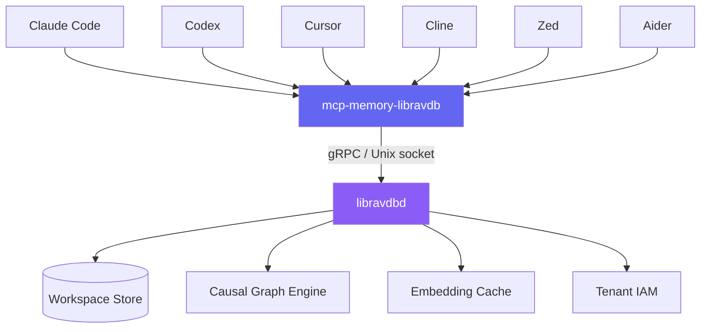

<h1 align="center">mcp-memory-libravdb</h1>

<p align="center">
  <strong>The official MCP server for the libravdbd cognitive memory kernel.</strong><br/>
  Give any AI coding agent persistent, semantic, causal-graph memory — with zero configuration.
</p>

<p align="center">
  <a href="https://pkg.go.dev/github.com/xDarkicex/mcp-libravdb-server"></a>
  <a href="https://goreportcard.com/report/github.com/xDarkicex/mcp-libravdb-server"></a>
  <a href="https://github.com/xDarkicex/mcp-libravdb-server/actions/workflows/go.yml"></a>
  <a href="https://github.com/xDarkicex/mcp-libravdb-server/actions/workflows/go.yml"></a>
  <a href="LICENSE"></a>
</p>

<p align="center">
  <a href="https://libravdb.com"><strong>Website</strong></a> ·
  <a href="https://discord.gg/x4cu4RA2p"><strong>Discord</strong></a> ·
  <a href="#quick-start"><strong>Quick Start</strong></a> ·
  <a href="#install"><strong>Install</strong></a>
</p>

---

## What is this?

Claude Code remembers what you tell it. Codex remembers. Cursor remembers. But they each remember *different things* — in *different places* — and none of them remember across sessions.

**libravdbd gives them a shared brain.** This MCP server is the bridge — any MCP-compatible client plugs into the same cognitive memory kernel. Semantic search. Deontic gating. Causal graph traversal. Workspace-aware multi-tenant isolation. One daemon, one protocol, every agent sees the same truth.

## Features

<table>
<tr>
<td width="50%">

###  Cognitive Memory
Six cognitive kinds — identity, constraint, decision, fact, preference, episode. The daemon classifies every memory. The MCP server just passes it through.

</td>
<td width="50%">

###  Shared Workspace
Every coding agent in the same project shares one tenant identity. Claude Code's refactor and Codex's bug fix feed the same causal graph.

</td>
</tr>
<tr>
<td width="50%">

###  Per-Project Isolation
Each directory gets its own tenant key via CWD hashing. No config. No setup. `--shared` when you want to collude.

</td>
<td width="50%">

###  Causal Graph Traversal
Walk why-IDs, how-IDs, and hop-targets from any memory record. The daemon's TopoRegistry does the math. You get the edges.

</td>
</tr>
<tr>
<td width="50%">

###  Zero Config
Point the MCP server at the daemon socket. Configure your client once. Everything else is automatic.

</td>
<td width="50%">

###  Works Everywhere
macOS, Linux, Docker. Homebrew tap. APT repo. Go install. Static binaries on every release.

</td>
</tr>
</table>

## Architecture



**The daemon does the intelligence.** This server translates MCP ↔ gRPC. That's it.

## Quick Start

```bash
# 1. Start the daemon
libravdbd

# 2. Start the MCP server
mcp-memory-libravdb stdio

# 3. Connect your client
claude mcp add libravdb-memory -- mcp-memory-libravdb stdio
```

## Install

| Platform | Command |
|----------|---------|
| **macOS** | `brew install xDarkicex/homebrew-mcp-libravdb/mcp-memory-libravdb` |
| **Linux** | `curl -fsSL https://xDarkicex.github.io/apt-mcp-libravdb/gpg.key \| sudo gpg --dearmor -o /usr/share/keyrings/mcp-libravdb.gpg`<br>`echo "deb [signed-by=/usr/share/keyrings/mcp-libravdb.gpg] https://xDarkicex.github.io/apt-mcp-libravdb stable main" \| sudo tee /etc/apt/sources.list.d/mcp-libravdb.list`<br>`sudo apt update && sudo apt install mcp-memory-libravdb` |
| **Go** | `go install github.com/xDarkicex/mcp-libravdb-server/cmd/mcp-memory-libravdb@latest` |
| **Docker** | `docker pull ghcr.io/xdarkicex/mcp-memory-libravdb` |

Or grab a binary from [releases](https://github.com/xDarkicex/mcp-libravdb-server/releases).

## Configuration

| Flag | Default | Description |
|------|---------|-------------|
| `--backend-addr` | `unix://~/.libravdbd/run/libravdb.sock` | gRPC backend address |
| `--tenant-key` | `libravdb-mcp-server` | Tenant key for data isolation |
| `--shared` | `false` | Disable per-workspace isolation |
| `--workspace` | (auto: CWD hash) | Explicit workspace name |
| `--degraded-ok` | `false` | Start even if daemon is unavailable |
| `--log-level` | `info` | debug, info, warn, error |

All flags map to env vars with `LIBRAVDB_` prefix. See `mcp-memory-libravdb --help` for the full list.

## CLI

```
mcp-memory-libravdb stdio              Start MCP server over stdio
mcp-memory-libravdb http               Start MCP server over Streamable HTTP
mcp-memory-libravdb status             Daemon health + tenant list
mcp-memory-libravdb status -v          + MCP server process info
mcp-memory-libravdb workspaces         Focused tenant list
mcp-memory-libravdb tenant list        All open tenants
mcp-memory-libravdb tenant inspect <k> Tenant details
mcp-memory-libravdb tenant evict <k>   Unload tenant
```

## MCP Tools

| Tool | Description |
|------|-------------|
| `memory.search` | Semantic search across collections |
| `memory.add` | Add a memory record (auto-UUID) |
| `memory.delete` | Delete by ID (single-ID only) |
| `memory.recall` | Search + deontic gating enrichment |
| `memory.graph` | Walk causal graph from any record |
| `memory.predict` | Predict next relevant memories |
| `memory.stats` | Node counts, kind/tier breakdowns |

## Client Setup

<details>
<summary><strong>Claude Code</strong></summary>

```bash
claude mcp add libravdb-memory -- mcp-memory-libravdb stdio
```
</details>

<details>
<summary><strong>Claude Desktop</strong></summary>

```json
{ "mcpServers": { "libravdb-memory": { "type": "stdio", "command": "mcp-memory-libravdb", "args": ["stdio"] } } }
```
</details>

<details>
<summary><strong>Codex</strong></summary>

```toml
[mcp_servers.libravdb-memory]
command = "mcp-memory-libravdb"
args = ["stdio"]
```
</details>

<details>
<summary><strong>Cursor</strong></summary>

```json
{ "mcpServers": { "libravdb-memory": { "type": "stdio", "command": "mcp-memory-libravdb", "args": ["stdio"] } } }
```
</details>

<details>
<summary><strong>Cline, Zed, Aider, and others</strong></summary>

Any MCP-compatible client — add a stdio server with command `mcp-memory-libravdb stdio`.
</details>

## Use Cases

**Code agents with shared memory.** Claude Code, Codex, and Aider in the same project see each other's decisions, constraints, and architecture choices through the shared workspace graph.

**Chat agents with read access.** OpenClaw or Hermes connect directly to the daemon with a chat tenant — read-only access to the code agent's workspace means they can answer "what did Claude build last week?" with full context.

**Per-project isolation.** Every directory gets its own tenant automatically. No config. Explicitly share with `--shared` when you need cross-project memory.

## Development

```bash
make          # lint + test-race + coverage + build
make test     # go test ./...
make build    # build binary
```

Go 1.25+. Coverage target: 90%+. CC limit: 8.

## Ecosystem

- [libravdbd](https://github.com/zephyr-systems/libravdbd) — the cognitive memory daemon
- [nanite](https://github.com/xDarkicex/nanite) — zero-allocation HTTP router + SSE
- [OpenClaw Memory](https://github.com/xDarkicex/openclaw-memory-libravdb) — TypeScript plugin
- [Hermes Memory](https://github.com/xDarkicex/hermes-memory-libravdb) — Python plugin
- [libravdb.com](https://libravdb.com) — official website
- [Discord](https://discord.gg/x4cu4RA2p) — community

## License

MIT © 2026 xDarkicex
